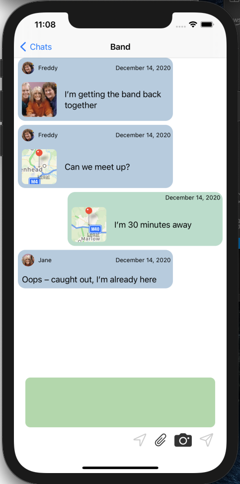
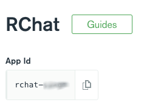

#  RChat – A Chat app built with SwiftUI and Realm

RChat is a chat application. Members of a chat room share messages, photos, location, and presence information with each other. The initial version is an iOS (Swift & SwiftUI) app, but we will use the same data model and backend Realm application to build an Android version in the future.

Read about the [Realm data architecture here](https://developer.mongodb.com/how-to/realm-swiftui-ios-chat-app) and [how the app was built here](https://developer.mongodb.com/how-to/building-a-mobile-chat-app-using-realm-new-way/).



## Building and running the app

1. If you don't already have one, [create a MongoDB Atlas Cluster](https://cloud.mongodb.com/), keeping the default name of `Cluster0`.
1. Install the [Realm CLI](https://docs.mongodb.com/realm/deploy/realm-cli-reference) and [create an API key pair](https://docs.atlas.mongodb.com/configure-api-access#programmatic-api-keys).
1. Download the repo and install the Realm app:
```
git clone https://github.com/ClusterDB/RChat.git
cd RChat/RChat-Realm/RChat
realm-cli login --api-key <your new public key> --private-api-key <your new private key>
realm-cli import # Then answer prompts, naming the app RChat
```
4. From the Atlas UI, click on the Realm logo and you will see the RChat app. Open it and copy the App Id



5. (Optional) Use `mongoimport` to import the empty database from the `dump` folder to create database indexes
1. Open the iOS project (using Xcode 13.2 or later)
```
cd ../../RChat-iOS
open RChat.xcodeproj
```
7. Update `RChatApp.swift` with your Realm App Id and then build

> The `new-schema` branch contains all of the iOS and backend Realm app code needed to add a new feature to tag chat message as high priority. This includes schema and code changes. You can find all of the steps to safely make such a schema change in a production app in [Migrating Your iOS App's Synced Realm Schema in Production](https://www.mongodb.com/developer/how-to/realm-sync-migration/).

> The `V2-schema` branch contains all of the iOS and backend Realm app code needed to make the `ChatMessage.author` field non-optional. You can find all of the steps to safely make such a schema change in a production app in [Migrating Your iOS App's Synced Realm Schema in Production](https://www.mongodb.com/developer/how-to/realm-sync-migration/).
